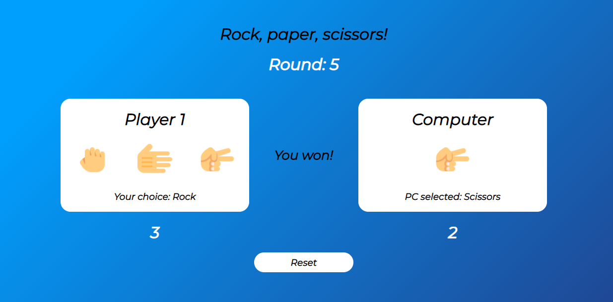
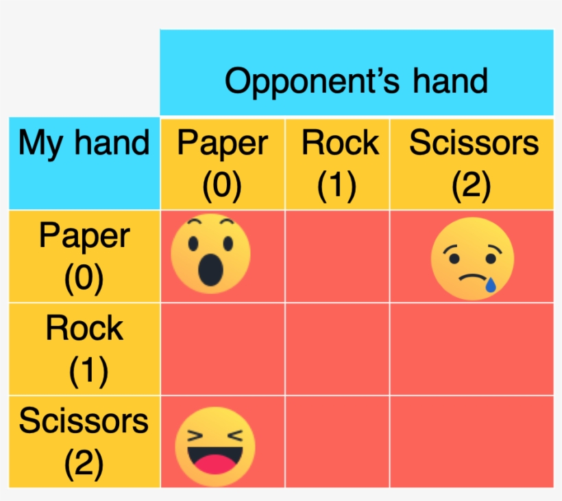

<!DOCTYPE html>
<html>
  <head>
    <meta charset="UTF-8">
    <title>Rock Paper Scissor Game</title>
  </head>
  <body>
    <h1>Rock Paper Scissor Game</h1>
    
This is a simple Rock Paper Scissor game with a score table embedded.

    <h2>Features</h2>
    <ul>
      <li>Allows user to select Rock, Paper, or Scissor</li>
      <li>Displays computer's random selection of Rock, Paper, or Scissor</li>
      <li>Displays the winner of each round</li>
      <li>Keeps track of user and computer score</li>
      <li>Resets the score table</li>
    </ul>
    <h2>Technology Stack</h2>
    <ul>
      <li>Python</li>
      <li>Pygame</li>
    </ul>
    <h2>Output Examples</h2>
    <h3>Gameplay Interface</h3>
    
    <h3>Score Table Interface</h3>
    
  </body>
</html>
